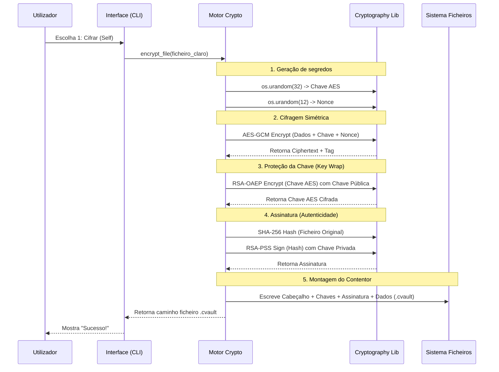

# Recursos para o Capítulo 3: Desenvolvimento e Arquitetura

Este ficheiro contém os diagramas, árvores e excertos de código solicitados para ilustrar o relatório técnico do projeto CipherVault.

---

## 3.2.1 Estrutura do Projeto (Árvore)

Aqui está a representação da organização modular do código-fonte na pasta `src/`.

```text
src/
├── main.py                  # Ponto de entrada da aplicação
└── ciphervault/             # Pacote principal
    ├── __init__.py          # Definição da versão (1.5.0)
    ├── cli.py               # Interface de Utilizador (Menu & Comandos)
    ├── contacts.py          # Gestão da lista de contactos (JSON)
    └── crypto.py            # Motor Criptográfico (AES, RSA, Formato de Ficheiro)
```

---

## 3.1.1 Arquitetura Global (Diagrama)

Este diagrama mostra como os módulos interagem entre si e com o sistema de ficheiros.

```mermaid
graph TD
    User((Utilizador))
    
    subgraph "Aplicação CipherVault"
        CLI[Interface CLI (cli.py)]
        Crypto[Motor Crypto (crypto.py)]
        Contacts[Gestor de Contactos (contacts.py)]
    end
    
    subgraph "Sistema de Ficheiros"
        Keys[Chaves RSA (.pem)]
        VaultFiles[Ficheiros .cvault]
        ContactDB[contacts.json]
    end

    User -->|Comandos / Menu| CLI
    CLI -->|Chama| Crypto
    CLI -->|Chama| Contacts
    
    Crypto -->|Lê/Escreve| Keys
    Crypto -->|Lê/Escreve| VaultFiles
    
    Contacts -->|Lê/Escreve| ContactDB
```

---

## 3.3.1 Construção do Cabeçalho Binário (Snippet)

Excerto de `src/ciphervault/crypto.py`. Este código mostra a utilização de `struct.pack` para criar o cabeçalho binário sequencial, garantindo um formato de ficheiro estrito.

```python
# Excerto do método encrypt_file em crypto.py

# ... (Preparação dos metadados JSON e das chaves) ...

# Escrita sequencial do formato binário .cvault
with open(output_path, "wb") as f:
    # [1] Magic Bytes para identificação rápida do tipo de ficheiro
    f.write(self.MAGIC)                                   # b"CVAULT"
    
    # [2] Versão do formato (para compatibilidade futura)
    f.write(struct.pack("B", self.VERSION_SELF))          # 1 byte (unsigned char)
    
    # [3] Flags (reservado para compressão ou opções futuras)
    f.write(struct.pack("B", 0x01))                       # 1 byte
    
    # [4] Tamanho dos metadados (para saber quanto ler de seguida)
    f.write(struct.pack("H", len(metadata_json)))         # 2 bytes (unsigned short)
    
    # [5] O corpo dos metadados (JSON codificado em bytes)
    f.write(metadata_json)
    
    # ... (Continuação da escrita: Chaves, Assinatura, Nonce, Tag, Ciphertext) ...
```

---

## 3.4.1 Fluxo de Cifragem (Diagrama de Sequência)

Este diagrama detalha as etapas criptográficas durante a ação "Cifrar ficheiro".



---

## 3.6 Gestão de Erros e UX (Snippet)

Excerto de `src/ciphervault/cli.py`. Este bloco mostra como a aplicação captura erros técnicos (como corrupção de dados ou formato incorreto) para mostrar uma mensagem compreensível ao utilizador final, em vez de um crash bruto.

```python
# Excerto da função _decrypt_flow em cli.py

try:
    # Tentativa de decifragem via motor crypto
    out_path = se.decrypt_file(p)
    console.print(f"\n[green]Sucesso![/green] Decifrado em: [bold]{out_path}[/bold]")

except Exception as e:
    msg = str(e)
    # Deteção específica de erros de segurança (Integridade/Formato)
    if "Formato de ficheiro inválido" in msg or "decryption failed" in msg.lower() or "tag mismatch" in msg.lower():
        # Mensagem de alerta crítico para o utilizador
        console.print("[red]O ficheiro .cvault está corrompido ou foi adulterado.[/red]")
    else:
        # Erro genérico (ex: I/O, permissões)
        console.print(f"[red]Falha ao decifrar:[/red] {e}")
```
